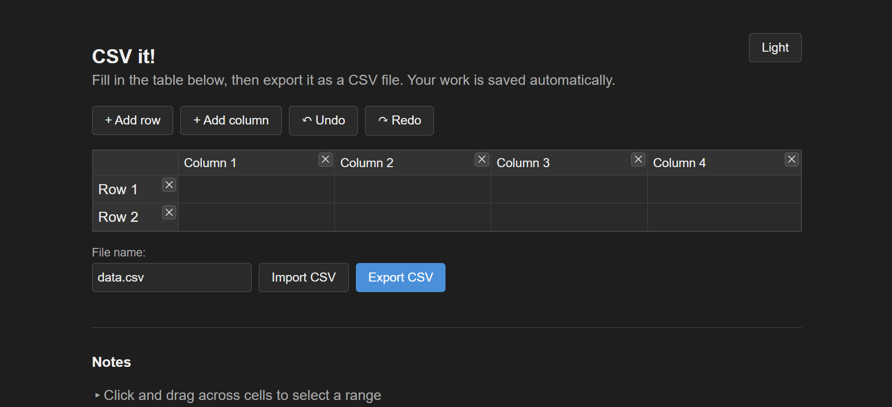

# CSV-it
HTML based, minimal, clean, and fast CSV maker that stays only on your local storage with simple UI and export.

## How to use?
No setup or installation required just click [here!](https://vd-sh.github.io/csv-it/index.html) to try it in browser! or visit [this](index.html) to see the code!

## Features
- Click and drag to select cells
- Arrow keys to move around, Enter to drop down a row
- Delete/Backspace clears a selection
- Ctrl+C / Ctrl+V to copy and paste
- Ctrl+Z / Ctrl+Y to undo and redo
- Add/remove rows and columns with a click
- Drag row or column headers to reorder them
- Import an existing CSV, or export your table as one
- Autosaves to your browser as you work
- Dark mode by default, light mode toggle top right

## How it works?
Single file. HTML, CSS, and JS all inline. No frameworks, no build step, no external requests. Everything on local storage. Edit or draft a CSV as you go!

## Known Limitations:
- No support for .xlsx imports and exports
- Storage is local i.e. not synced across multiple devices

## License
[MIT](LICENSE) - Read, Use, Modify, Do whatever you want to!

## Notes
- This is a simple tool for make as you go builders, who want to work on temporary edits for CSV tables or sheets.
- This website was made by [vd-sh](https://github.com/vd-sh).
- Make sure to see my other projects like [BakeBuild- Cookie Cutters](https://github.com/vd-sh/cookie-cutters), [FuseRing- Keyrings](https://github.com/vd-sh/key-rings), [Retropuzz Game](https://github.com/vd-sh/retropuzz) or just visit the [profile](https://github.com/vd-sh) to see the latest works :)
